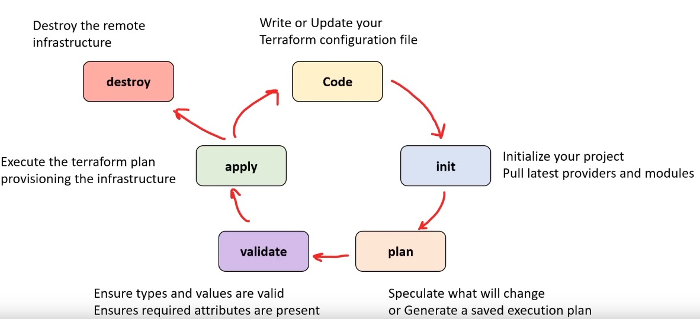

# Terraform Beginner Bootcamp 2023 - Week 0

⬅️ [Go Back](../README.md)

## Table of Contents

- [Semantic Versioning](#semantic-versioning-)
- [Installing Terraform CLI](#installing-terraform-cli)
  - [New installation script (Bash file)](#new-installation-script-bash-file)
- [Environment Variables](#environment-variables)
  - [Set and retrieve a variable inside the bash file](#set-and-retrieve-a-variable-inside-the-bash-file)
  - [Persist an env variable inside gitpod](#persist-an-env-variable-inside-gitpod)
- [Installing AWS CLI](#installing-aws-cli)
- [Terraform Registry](#terraform-registry)
  - [Terraform CLI](#terraform-cli)
  - [Terraform State](#terraform-state)
- [Installing additional Terraform providers](#installing-additional-terraform-providers)
- [Terraform Cloud](#terraform-cloud)
  - [Terraform Variables](#terraform-variables)
- [Bash Alias](#bash-alias)

## Semantic Versioning

Given a version number **MAJOR.MINOR.PATCH** (e.g. `1.0.1`), increment the:

- **MAJOR** version when you make incompatible API changes
- **MINOR** version when you add functionality in a backward compatible manner
- **PATCH** version when you make backward compatible bug fixes

More information [here](https://semver.org/).

## Installing Terraform CLI

Updating the gitpod.yml installation script to install the latest version of Terraform CLI.
Instructions [here](https://developer.hashicorp.com/terraform/tutorials/aws-get-started/install-cli)

### New installation script (Bash file)

- check your [Linux distrubution](https://linuxize.com/post/how-to-check-linux-version/): `cat /etc/os-release`
- add [shebang](https://linuxize.com/post/bash-shebang/) to the script file: `#!/usr/bin/env bash`
- more on [Linux permissions](https://www.redhat.com/sysadmin/linux-file-permissions-explained):
  `chmod u+x <script_name>`
- use `before` instead of `init` hook, check [GitPod tasks](https://www.gitpod.io/docs/configure/workspaces/tasks), in short, `init` will not re-run if we restart an existing workspace, `before` will.

The installation file is located here: [`./bin/install_teffaform_cli`](./bin/install_terraform_cli)

## Environment Variables

List and filter (`grep`) env variables:
`env | grep GITPOD `
`env | grep terraform-beginner-bootcamp`

### Set and retrieve a variable inside the bash file

We can save the var inside our bash file in order to persist it through all of our future bash sessions.

```bash
PROJECT_ROOT='/workspace/terraform-beginner-bootcamp-2023'
cd $PROJECT_ROOT
```

We can also `export` variables to our bash environment.

```bash
export PROJECT_ROOT='/workspace/terraform-beginner-bootcamp-2023'
```

To remove the variable from our bash environment, run `unset PROJECT_ROOT`.

### Persist an env variable inside gitpod

```bash
gp env HELLO='world'
```

All future workspaces launched will also have access.
You can also set it inside `.gitpod.yml` file (but only good for non-sensitive en vars).
To unset a variable, run `gp env -u HELLO`.

## Installing AWS CLI

Installed via a bash script. The file is located here: [`./bin/install_aws_cli`](./bin/install_aws_cli)
AWS CLI installation instructions [here](https://docs.aws.amazon.com/cli/latest/userguide/getting-started-install.html).

Verify that AWS CLI is installed by running `aws` which will open up a prompt, then run a test command like:

```bash
aws sts get-caller-identity
```

This will error until all the necessary env variables are set.

Only use `aws configure` wizard on your local machine. In a cloud environment use [env vars](https://docs.aws.amazon.com/cli/latest/userguide/cli-configure-envvars.html) instead.

Once you've set the necessary variables (using `gp env`) test the above function again. If succesful, it should return a `json` payload.

> Avoid pushing your AWS credentials to GitHub!

## Terraform Registry

[Terraform registry](https://registry.terraform.io/)

A Terraform provider is an interface used for API interactions (with AWS, Azure, GCP etc).
A Terraform module is a package or a template that makes it easier to reuse code.

We'll be using the [random provider](https://registry.terraform.io/providers/hashicorp/random/latest) to generate our resources (random bucket name).

### Terraform CLI



Type `terraform` to see all the available commands.

`terraform init` - initialize a working directory containing Terraform configuration files (`.tf` files and `.terraform.lock.hcl` file)

> Make sure to add the `.terraform` directory to `.gitignore` file (those binaries are not meant to be pushed to GitHub!)

Then type: `terraform plan` to see what changes will be made to the infrastructure (aka changeset).
Lastly run `terraform apply` to apply the changes.
If you want to auto approve the changes, run `terraform apply -auto-approve` instead.
To only output the value of our `random_bucket_name`, run `terraform output random_bucket_name`.

### Terraform State

`terraform_tfstate` file is used to store the state of our infrastructure. It's a JSON file that contains the metadata of our resources. (should be added to `.gitignore` file)

`terraform.tfstate.backup` is a backup of the previous state.

## Installing additional Terraform providers

Add the aws provider to the `required_providers` block in `main.tf` file.

Anytime you add a new provider, you need to run `terraform init` again.

Note that under the hood, Terraform is using the env variables (that we exported earlier) to authenticate with AWS.

To destroy terraform resources, run `terraform destroy`. To auto approve, run `terraform destroy -auto-approve`.

## Terraform Cloud

We will use the free tier of Terraform Cloud to store our state file.

A Terraform Cloud Workspace is a place where we can store our Terraform configuration files and state files.

A Terraform Cloud Project is a collection of workspaces.

Add the `cloud` block to `main.tf` file, then `terraform init` again and finally `terraform apply`.
You'll first have to authenticate with Terraform Cloud using `terraform login`.
This will open up a browser window where you can authenticate with Terraform Cloud and authorize in the CLI by pasting the generated token.

We can automate the TF cloud token generation for our gitpod environment by adding creating a long-lived token in Terraform Cloud (30 days) and adding a generator script to our `bin` folder (see [`./bin/generate_tf_cloud_token`](./bin/generate_tf_cloud_token)).

Then we can add the token to our gitpod environment by running `gp env TF_CLOUD_TOKEN=<token>`.
We can also add it to our bash environment by running `export TF_CLOUD_TOKEN=<token>`.

Don't forget to update the `.gitpod.yml` file to run the token generator script.

### Terraform Variables

You'll need to add the AWS auth variables to Terraform Cloud as well (make sure to use the `sensitive` flag for the secret key).

The region can be set in the `main.tf` file.

To avoid the warning when running `terraform plan`, initialise the AWS variables inside `main.tf` file.

```terraform
provider "aws" {
  region = "eu-west-2"
}

variable "AWS_ACCESS_KEY_ID" {
  description = ""
  type        = string
  default     = ""
}

variable "AWS_SECRET_ACCESS_KEY" {
  description = ""
  type        = string
  default     = ""
}
```

## Bash Alias

Add a `tf` alias to your `.bash_profile` using a bash script from our `bin` folder, see [`./bin/bash_alias`](./bin/bash_alias).
